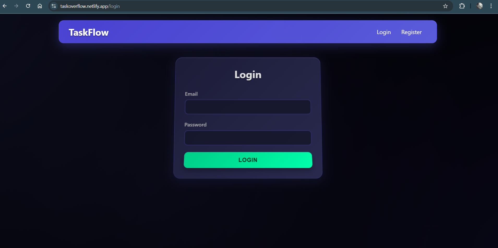
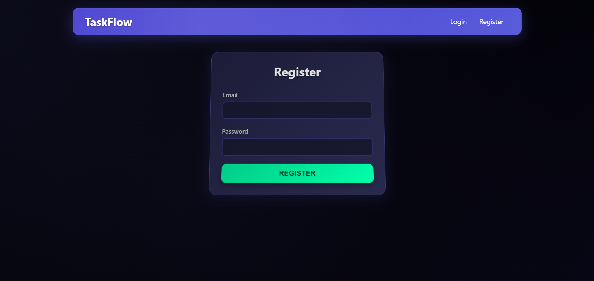
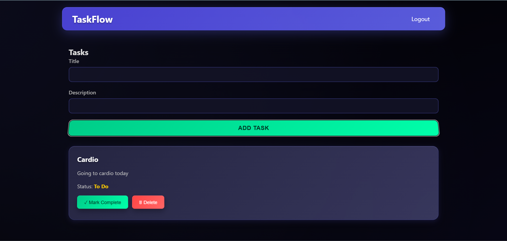
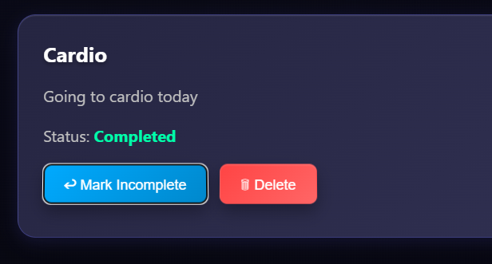
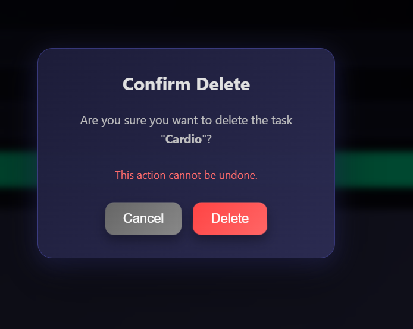
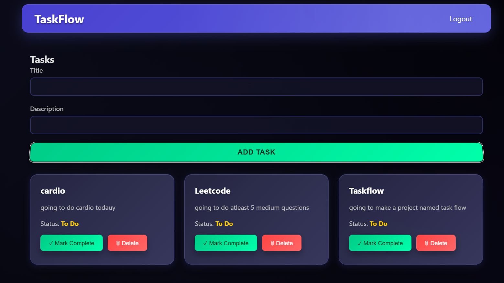

# Task Management Application 

Check out [Task Flow](https://taskoverflow.netlify.app).


A full-stack web application for managing tasks with user authentication, subtasks, and task dependencies, including circular dependency detection.

## Overview
This application allows users to register, log in, create and manage tasks with priorities and due dates, organize subtasks, and handle task dependencies. It implements all core features and the required challenge feature for hierarchical tasks with dependency management.

## Technologies Used
- **Frontend**: React.js, Tailwind CSS, Redux Toolkit, Axios, React Router
- **Backend**: Node.js, Express, MongoDB, Mongoose, JWT, bcrypt, Axios
- **Database**: MongoDB
- **Other**: JavaScript, ESLint, Prettier

## Setup Instructions
1. **Clone the Repository**:
   ```bash
   git clone https://github.com/digvijay3184/task-management-app.git
   cd task-management-app


## Install Dependencies:

Backend:cd backend && npm install


Frontend:cd frontend && npm install


## Set Up Environment Variables:

Backend: Copy backend/.env.example to .env and update:MONGO_URI=mongodb://localhost:27017/task_management
JWT_SECRET=your_jwt_secret
PORT=5000


Frontend: Copy frontend/.env.example to .env and update:VITE_API_URL=http://localhost:5000/api


## Set Up Database:

Ensure MongoDB is running locally or use a cloud MongoDB instance (e.g., MongoDB Atlas).
No migrations are needed as Mongoose handles schema creation dynamically.


## Start Development Servers:

Backend:cd backend && npm run dev


Frontend:cd frontend && npm run dev


## Access the Application:

Frontend runs on http://localhost:5173
Backend API runs on http://localhost:5000/api


## Assumptions and Decisions

Used JavaScript instead of TypeScript for faster development within the time constraint.
Implemented a simple nested list UI for subtasks and dependencies using Tailwind CSS for responsiveness.
Used Mongoose for MongoDB schema management and queries.
Implemented Depth-First Search (DFS) for circular dependency detection in the backend.
Focused on functionality over advanced UI styling as per guidelines.
Skipped bonus features (e.g., dark mode, search) to prioritize the challenge feature.
Used Redux Toolkit for state management to handle complex task relationships.

## Known Issues and Limitations

UI is functional but minimal; no graph visualizations for task dependencies.
No automated tests included due to time constraints.
Limited error handling for rare edge cases in long dependency chains.
MongoDB's lack of native CASCADE DELETE required manual handling in code.
No real-time updates (WebSockets) implemented.

Challenge Feature Approach
Circular Dependency Detection

Algorithm: Depth-First Search (DFS) to detect cycles in the dependency graph.
Implementation:
Before adding a dependency, the backend checks if it would create a cycle using a recursive DFS function (hasCircularDependency).
Tracks visited tasks and the current path to detect cycles.
Returns a 400 error with a clear message if a cycle is detected.


Test Cases:
Simple Dependency: Task A → Task B (successful).
Chain Dependency: Task A → Task B → Task C (successful).
Circular Dependency: Task A → Task B → Task C → Task A (detected and blocked).


## Database Optimization

Used MongoDB indexes on userId, parentTaskId, and dependencies fields for efficient queries.
Avoided N+1 problems by using Mongoose's populate for fetching related tasks.
Manually implemented cascade deletion for subtasks and dependencies.

## UI

Subtasks are displayed as nested lists under parent tasks with indentation.
Blocked tasks are grayed out with labels showing their dependencies.
Dependencies are listed with links to dependent tasks.
Error messages for circular dependencies are displayed in the UI.

## API Documentation
### Authentication

POST /api/auth/register - Register a new user { email, password }.
POST /api/auth/login - Login and receive JWT token { email, password }.
POST /api/auth/logout - Logout (client-side token removal).
GET /api/auth/me - Get current user info (requires JWT).

### Tasks

GET /api/tasks - Get all tasks for the logged-in user, sorted by due date and priority.
POST /api/tasks - Create a task { title, description?, dueDate?, priority?, status?, parentTaskId? }.
GET /api/tasks/:id - Get a single task.
PUT /api/tasks/:id - Update a task { title?, description?, dueDate?, priority?, status? }.
DELETE /api/tasks/:id - Delete a task (removes subtasks).

### Challenge Feature

POST /api/tasks/:id/subtasks - Create a subtask { title, description?, dueDate?, priority? }.
GET /api/tasks/:id/subtasks - Get all subtasks for a task.
POST /api/tasks/:id/dependencies - Add a dependency { dependsOnTaskId }.
DELETE /api/tasks/:id/dependencies/:depId - Remove a dependency.
GET /api/tasks/:id/dependencies - Get task dependencies.
GET /api/tasks/:id/dependents - Get tasks that depend on this task.
POST /api/tasks/validate-dependencies - Check for circular dependencies { taskId, dependsOnTaskId }.
GET /api/tasks/tree - Get hierarchical task structure.

# Screenshots
## Pages



## Operations
Updation of the Task

Deletion of a Task 

Multiple Tasks
